# BotMan VK Community Callback driver

BotMan driver to connect VK Community with [BotMan](https://github.com/botman/botman) via Callback API.

[](https://opensource.org/licenses/MIT)
[](https://packagist.org/packages/yageorgiy/botman-vk-community-callback-driver)


## Contributing

Contributions are welcome, I would be glad to accept contributions via Pull Requests. 🙂 See `Contributors` tab for more details.

## Support
Table of driver's features:

|Feature|Is Supported|
| --- | --- |
|Sending text messages|✔ Fully supported|
|Sending images|✔ Supported (no titles for images provided by VK API, pictures can't be uploaded to external albums with community token)*|
|Sending videos|⚠ Partially supported (uploading videos with community token is not supported by VK API)*|
|Sending audio|⚠ Partially supported (uploading audio is restricted by VK API)|
|Sending voice messages|✔ Fully supported via `Audio` object with `addExtras('vk_as_voice', true)`|
|Sending documents (files)|✔ Supported (some files might be restricted by the platform to be uploaded, the updated criteria list is no longer public in VK docs)|
|Sending links|✔ Supported|
|Sending locations|✔ Fully supported|
|Sending stickers|✔ Supported as an additional parameter to reply|
|Sending wall posts|✔ Supported as an additional parameter to reply|
|Sending polls|✔ Supported as an additional parameter to reply|
|Sending market items|✔ Supported as an additional parameter to reply|
|Sending keyboards|✔ Fully supported|
|Sending carousels|✔ Supported as an additional parameter to reply|
|Listening for images|✔ Supported (no titles for images provided by VK API)|
|Listening for videos|⚠ Partially supported (no video URL provided by VK API, info of copyrighted videos can be unavailable via API)*|
|Listening for audio|✔ Fully supported|
|Listening for files|✔ Fully supported|
|Listening for locations|✔ Fully supported|
|Listening for voice messages|❌ Not supported yet|
|Receiving messages with mixed attachments|✔ Fully supported|
|Typing status|✔ Fully supported (photo or document upload, user call)|
|Mark seen|⚠ Partially supported (user-created conversations can't be marked via API)|
|Retrieving user data|✔ Fully supported (use `VK_USER_FIELDS` property for retrieving custom user fields)|
|Usage in VK conversations|✔ Supported|
|Multiple communities handling|❌ Not supported yet|
|VK Speech Recognition Service|❌ Not implemented yet|
|VK API low-level management|✔ Fully supported|
|Events listener|✔ Fully supported (as for 14.08.2020)|

\* \- uploading feature with user token is under construction


## Setup
### Getting the Community API key
From the page of your community, go to `Manage -> Settings tab -> API usage -> Access tokens tab`. Click `Create token` button.

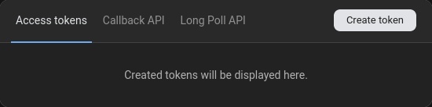

Then tick all the permissions in the dialog box.

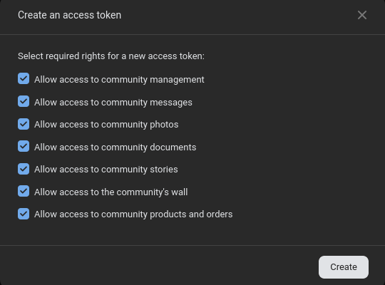

Copy your created token by clicking `Show` link.

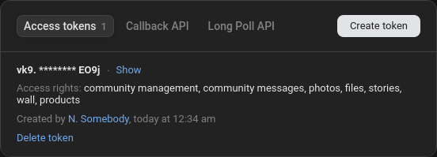

### Installing the driver
Require the driver via composer:
```bash
composer require yageorgiy/botman-vk-community-callback-driver
```

If you're using BotMan Studio, you should define in the `.env` file the following properties:

```dotenv
VK_ACCESS_TOKEN="REPLACE_ME"                    # User or community token for sending messages (from Access tokens tab, see above)
VK_SECRET_KEY="REPLACE_ME"                      # Secret phrase for validating the request sender (from Callback API tab, see above)
VK_API_VERSION=5.103                            # API version to be used for sending an receiving messages (should be 5.103 and higher) (not recommended to change)
VK_MESSAGES_ENDPOINT=https://api.vk.com/method/ # VK API endpoint (don't change it if unnecessary)
VK_CONFIRM=                                     # DEPRECATED SINCE v.1.4.2, LEAVE BLANK (EMPTY STRING) - see 'Mounting & confirming the bot' section. Confirmation phrase for VK
VK_GROUP_ID="REPLACE_ME"                        # Community or group ID
VK_USER_FIELDS=                                 # Extra user fields (see https://vk.com/dev/fields for custom fields) (leave blank for no extra fields) (note: screen_name is already included!)
```

If you don't use BotMan Studio, the driver should be applied manually:
```php
// ...

// Applying driver
DriverManager::loadDriver(\BotMan\Drivers\VK\VkCommunityCallbackDriver::class);

// Applying settings for driver
BotManFactory::create([
    "vk" => [
        "token" => "REPLACE_ME",                    // User or community token for sending messages (from Access tokens tab, see above)
        "secret" => "REPLACE_ME",                   // Secret phrase for validating the request sender (from Callback API tab, see above)
        "version" => "5.103",                       // API version to be used for sending an receiving messages (should be 5.103 and higher) (not recommended to change)
        "endpoint" => "https://api.vk.com/method/", // VK API endpoint (don't change it if unnecessary)
        "confirm" => "",                            // DEPRECATED SINCE v.1.4.2, LEAVE BLANK (EMPTY STRING) - see 'Mounting & confirming the bot' section. Confirmation phrase for VK
        "group_id" => "REPLACE_ME",                 // Community or group ID
        "user_fields" => ""                         // Extra user fields (see https://vk.com/dev/fields for custom fields) (leave blank for no extra fields) (note: screen_name is already included!)
    ]
]);

// ...
```

### Mounting & confirming the bot
**⚠ \[Migrating from v.1.4.1 and older\]** Method of confirming the bot has changed since driver version 1.4.2: validation should be managed by using events listener, `VK_SECRET_KEY` (or `$botmanSettings["vk"]["confirm"]`) should be blank (empty string).

From the page of your community, go to `Manage -> Settings tab -> API usage -> Callback API tab`:

- Choose `5.103` API version.
- Fill the required field of URL address of your's bot mount (examples: https://example.com/botman, http://some.mysite.ru/botman).
- Fill the Secret key field *(required for driver!)*:

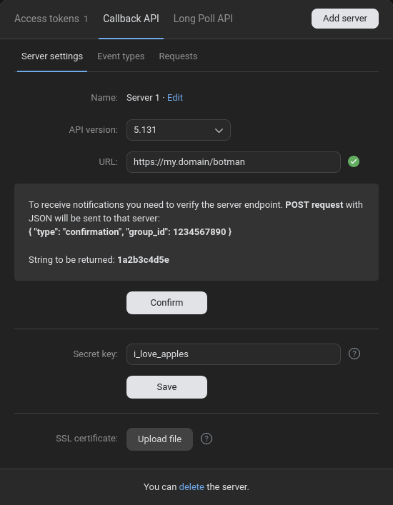

- Find the string (validation code) in section `String to be returned`:


- Add the following code to `routes/botman.php` file, replace `REPLACE_ME` with the validation code (e.g. `1a2b3c4d5e`):

```php
$botman->on("confirmation", function($payload, $bot){
    // Use $payload["group_id"] to get group ID if required for computing the passphrase.
    echo("REPLACE_ME");
});
```

- Click `Confirm` button.


## Quick guide with examples
*In usage examples, the used file is `routes/botman.php`.*

### Sending simple message
If bot receives `Hello` message, it will answer `Hi, <First Name>`:
```php
$botman->hears('Hello', function ($bot) {
    $bot->reply('Hi, '.$bot->getUser()->getFirstName());
});
```


### Typing activity
Bot will wait 10 seconds before answering the question:

```php
$botman->hears("What\'s your favourite colour\?", function ($bot) {
    $bot->reply('Let me think...');
    $bot->typesAndWaits(10);
    $bot->reply("I guess it's orange! 😄");
});
```


After all, it will answer:


### Attaching image
If bot receives `Gimme some image` message, it will answer `Here it is!` with an attached image:

```php
use BotMan\BotMan\Messages\Attachments\Image;
use BotMan\BotMan\Messages\Outgoing\OutgoingMessage;

$botman->hears('Gimme some image', function ($bot) {
    // Create attachment
    $attachment = new Image('https://botman.io/img/logo.png');
    // $attachment->addExtras("vk_photo", "photo123456_123456"); // Or send an already uploaded photo (driver will ignore image url)    

    // Build message object
    $message = OutgoingMessage::create('Here it is!')
        ->withAttachment($attachment);

    // Reply message object
    $bot->reply($message);
});
```

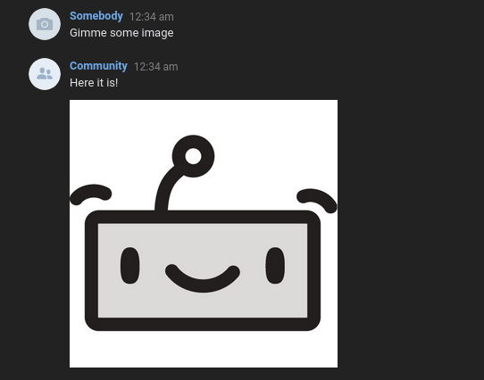

### Attaching video

Example of sending an already uploaded video:

**Note**: uploading videos to VK is not supported by the driver yet.

```php
use BotMan\BotMan\Messages\Attachments\Video;
use BotMan\BotMan\Messages\Outgoing\OutgoingMessage;

$botman->hears('Gimme some video', function ($bot) {
    // Create attachment
    $attachment = new Video('http://unused-video-url');
    // Attaching already uploaded videos is the ONLY way to send them (as for now):
    $attachment->addExtras("vk_video", "video-2000416976_41416976"); // Send an already uploaded video (driver will ignore video url)

    // Build message object
    $message = OutgoingMessage::create('Here it is!')
        ->withAttachment($attachment);

    // Reply message object
    $bot->reply($message);
});
```

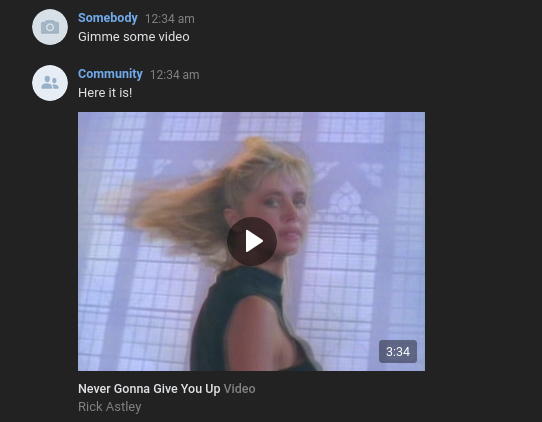

### Attaching audio

Example of sending an already uploaded audio:

**Note**: uploading audio to VK is restricted by the platform.

```php
use BotMan\BotMan\Messages\Attachments\Audio;
use BotMan\BotMan\Messages\Outgoing\OutgoingMessage;

$botman->hears('Gimme some audio', function ($bot) {
    // Create attachment
                            // URL can be uploaded ONLY as voice message (due to restrictions of VK)
    $attachment = new Audio('https://unused-audio-url');
    $attachment->addExtras("vk_audio", "audio371745438_456268888"); // Send an already uploaded audio (driver will ignore audio url and vk_as_voice parameter)

    // Build message object
    $message = OutgoingMessage::create('Here it is!')
        ->withAttachment($attachment);

    // Reply message object
    $bot->reply($message);
});
```

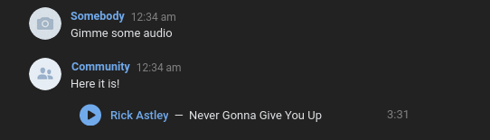

### Sending voice message

Voice messages can be send using `Audio` with extra parameter `vk_as_voice = true`. 

Example of sending a voice message with message text:

**Note**: better to upload an *.ogg file rather than *.mp3, *.wav and others. See [Uploading Voice Message](https://vk.com/dev/upload_files_3) for more info.

```php
use BotMan\BotMan\Messages\Attachments\Audio;
use BotMan\BotMan\Messages\Outgoing\OutgoingMessage;

$botman->hears('Sing me a song', function ($bot) {
    // Create attachment
                            // URL can be uploaded ONLY as voice message (due to restrictions of VK)
    $attachment = new Audio('https://url-to-ogg-file');
//  $attachment->addExtras("vk_audio", "audio371745438_456268888"); // Send an already uploaded audio (driver will ignore audio url and vk_as_voice parameter)
    $attachment->addExtras("vk_as_voice", true);                    // Send as voice message (better to use *.ogg file)

    // Build message object
    $message = OutgoingMessage::create('Well...')
        ->withAttachment($attachment);

    // Reply message object
    $bot->reply($message);
});
```

During upload, the driver will send "recording audio" activity:


The result:

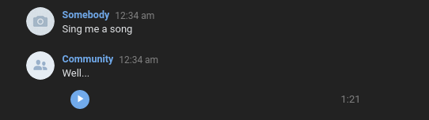

### Attaching document (file)

Example of sending file:

**Note**: not all files are available to upload. See [Uploading documents](https://vk.com/dev/upload_files_2?f=10.%2BUploading%2BDocuments) for more info.

```php
use BotMan\BotMan\Messages\Attachments\File;
use BotMan\BotMan\Messages\Outgoing\OutgoingMessage;

$botman->hears("Any files\?", function ($bot) {
    $attachment = new File('https://url-to-file');
//  $attachment->addExtras("vk_doc", "doc123456_123456"); // Send an already uploaded document (driver will ignore audio url and vk_doc_title, vk_doc_tags parameters)
    $attachment->addExtras("vk_doc_title", "Cool guy.gif"); // Title
    $attachment->addExtras("vk_doc_tags", "cool, guy"); // Document tags

    // Build message object
    $message = OutgoingMessage::create('Yep!')
        ->withAttachment($attachment);

    // Reply message object
    $bot->reply($message);
});
```

Uploading a file will also trigger "sending message" activity.

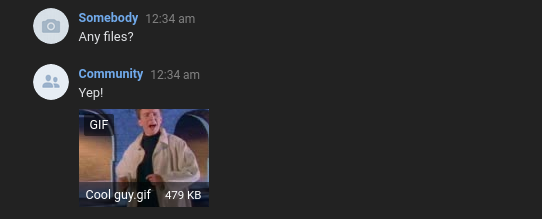

### Attaching location

Example of sending location (taken from BotMan docs):

```php
use BotMan\BotMan\Messages\Attachments\Location;
use BotMan\BotMan\Messages\Outgoing\OutgoingMessage;

$botman->hears('Any locations\?', function($bot) {
    // Create attachment
    $attachment = new Location(61.766130, -6.822510, [
        'custom_payload' => true,
    ]);

    // Build message object
    $message = OutgoingMessage::create('Locations are also supported!')
        ->withAttachment($attachment);

    // Reply message object
    $bot->reply($message);
});
```

The result:

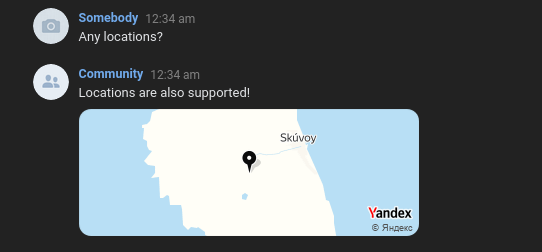

### Additional parameters

Additional parameters are used to append or replace message request parameters.

**Note:** `v` and `access_token` fields are ignored to be replaced. Change their parameters in `.env` file or in configuration array.

Example of replacing message text:

```php
$botman->hears('Show me the replaced message', function($bot) {
    $bot->reply("This string will be ignored", [
        "message" => "This message string will be sent"
    ]);
});
```


See [messages.send method](https://vk.com/dev/messages.send) for more info.

### Sending question buttons (simple keyboard)

Example of sending simple keyboard via adding buttons to question. Keyboard will be shown as **`one_time = true`** (shown once) and **`inline = false`** (default non-inline keyboard), one button in a row. See `Sending full-supported keyboard` section for in-depth setup.

```php
use BotMan\BotMan\Messages\Outgoing\Actions\Button;
use BotMan\BotMan\Messages\Outgoing\Question;
$botman->hears("List of functions\?", function ($bot) {
    $question = Question::create('My list of functions:')
        ->addButtons([
            Button::create('Function 1')->value('f1'),
            Button::create('Function 2')->value('f2'),
            Button::create('Function 3')->value('f3'),
            Button::create('Function 4')->value('f4'),
            Button::create('Function 5')->value('f5')
        ]);

    $bot->ask($question, function ($answer) {
        // Detect if button was clicked:
        if ($answer->isInteractiveMessageReply()) {
            $selectedValue = $answer->getValue(); // Contains button value e.g. 'f1', 'f2', ...
            $selectedText = $answer->getText(); // Contains title e.g. 'Function 1', 'Function 2', ...
        }
    });
});
```

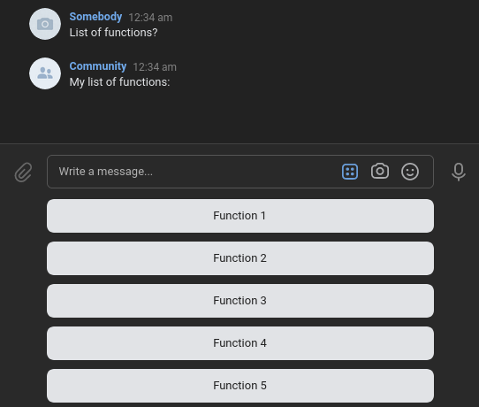

**Note**: don't use `$answer->getText()` for validation purposes as it can be changed by the client (user). Use `$answer->getValue()` instead.

**Note**: better to send keyboards only in Conversation class, asking a question with buttons. See more [here](https://botman.io/2.0/conversations).

### Customizing the question buttons (simple keyboard)

**⚠ \[Migrating from v.1.4.x and older\]** Fields of `__x` and `__y` are now ignored by the driver. Use `VKKeyboard` serializing class to build a keyboard and add it to `$additionalParameters` of your outcoming message.

You can also change button's properties via additional parameters such as colour:

```php
//...
$botman->hears("List of functions\?", function ($bot) {
    $question = Question::create('My list of functions:')
        ->addButtons([
            Button::create('Function 1')->value('f1')->additionalParameters([
                "color" => "secondary" // Colour (see available colours here - https://vk.com/dev/bots_docs_3)
            ]),
            Button::create('Function 2')->value('f2')->additionalParameters([
                "color" => "negative"
            ]),
            Button::create('Function 3')->value('f3')->additionalParameters([
                "color" => "primary"
            ]),
            Button::create('Function 4')->value('f4')->additionalParameters([
                "color" => "primary"
            ]),
            Button::create('Function 5')->value('f5')->additionalParameters([
                "color" => "primary"
            ])
        ]);

    $bot->ask($question, function ($answer) {
        //...
    });
});
```

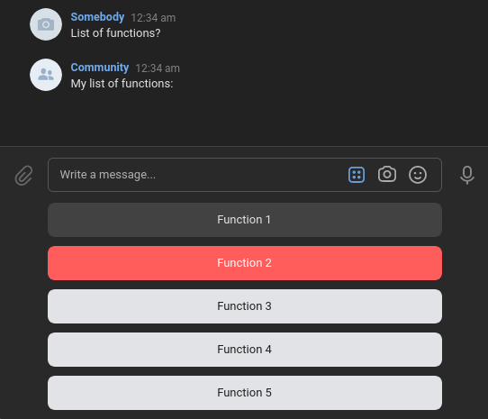

See [VK documentation page](https://vk.com/dev/bots_docs_3) for available colours, types and other features. Just add new fields in array of additional parameters as it is shown in the example above.


### Sending native keyboard

Native keyboard can be send as an additional parameter **(works only for VK!)**:

```php
use BotMan\Drivers\VK\Extensions\VKKeyboard;
use BotMan\Drivers\VK\Extensions\VKKeyboardButton;
use BotMan\Drivers\VK\Extensions\VKKeyboardRow;

$botman->hears('keyboard', function(BotMan $bot) {
    $keyboard = new VKKeyboard();
    $keyboard->setInline(false);    // Setting the inline mode ("inline" parameter)
    $keyboard->setOneTime(false);   // Setting "one_time" parameter
    
    $keyboard->addRows(
        // Top row
        new VKKeyboardRow([
            // Text example
            ( new VKKeyboardButton() )->setColor("primary")->setText("Sample text")->setValue("button1"),
            // UTF-8 text example
            ( new VKKeyboardButton() )->setColor("primary")->setText("Текст для примера")->setValue("button2"),
        ]),
        // Middle row
        new VKKeyboardRow([
            // Long text trim example
            ( new VKKeyboardButton() )
                // Colour (see available colours here - https://vk.com/dev/bots_docs_3)                
                ->setColor("default")
                
                // Long text will be trimed with ellipsis at the end of the label
                ->setText("Lorem ipsum dolor sit amet, consectetur adipiscing elit. Nam nec ultrices purus, ut sollicitudin arcu.")

                // Set button value
                ->setValue("button3"), 
        ]),
        // Bottom row
        new VKKeyboardRow([
            // Emoji example
            ( new VKKeyboardButton() )->setColor("negative")->setText("⛔")->setValue("button4"),
            ( new VKKeyboardButton() )->setColor("primary")->setText("⚠")->setValue("button5"),
            ( new VKKeyboardButton() )->setColor("positive")->setText("✅")->setValue("button6"),
        ])
    );

    $bot->reply("Native keyboard:", [
        "keyboard" => $keyboard->toJSON()
    ]);
});
```

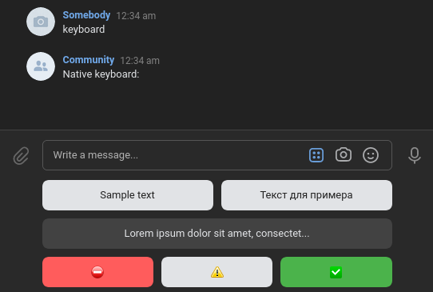

You can also send a Question with additional parameters with keyboard:

```php
// ...
$bot->ask($question, function ($answer) {
    // Detect if button was clicked:
    if ($answer->isInteractiveMessageReply()) {
        $selectedValue = $answer->getValue(); // Contains button value e.g. 'f1', 'f2', ...
        $selectedText = $answer->getText(); // Contains title e.g. 'Function 1', 'Function 2', ...
    }
}, [
    "keyboard" => $keyboard->toJSON()
]);
// ...
```

### Listening for images

Native way for receiving images.

**Note**: no message text will be provided via `receivesImages()` method.

```php
$botman->receivesImages(function($bot, $images) {
    foreach ($images as $image) {
        $url = $image->getUrl(); // The direct url
        $title = $image->getTitle(); // The title (empty string as titles are not supported by VK)
        $payload = $image->getPayload(); // The original payload

        $bot->reply("Detected image: {$url}");
    }
});
```

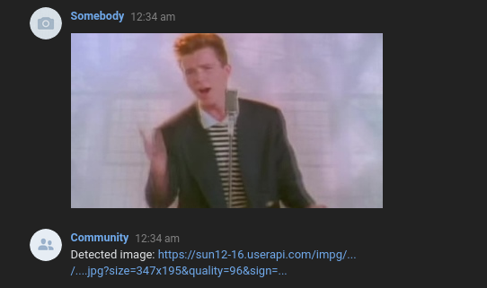

### Listening for videos

Native way for receiving videos.

**Note**: no message text will be provided via `receivesVideos()` method.

```php
$botman->receivesVideos(function($bot, $videos) {
    foreach ($videos as $video) {
        $url = $video->getUrl(); // The direct url
        $payload = $video->getPayload(); // The original payload

        // For YouTube videos title can be accessed in the following way:
        $bot->reply("Detected video: {$payload["title"]}");
    }
});
```

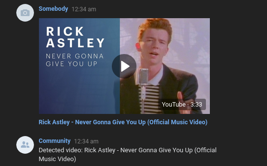

### Listening for audio

Native way for receiving audio.

**Note**: no message text will be provided via `receivesAudio()` method.

```php
$botman->receivesAudio(function($bot, $audios) {
    foreach ($audios as $audio) {
        $url = $audio->getUrl(); // The direct url
        $payload = $audio->getPayload(); // The original payload

        $bot->reply("Detected audio: {$url}");
    }
});
```

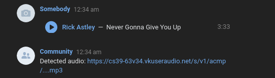

### Listening for documents (files)

Native way for receiving files.

**Note**: no message text will be provided via `receivesFiles()` method.

```php
$botman->receivesFiles(function($bot, $files) {
    foreach ($files as $file) {
        $url = $file->getUrl(); // The direct url
        $payload = $file->getPayload(); // The original payload

        $bot->reply("Detected file (document): {$url}");
    }
});
```

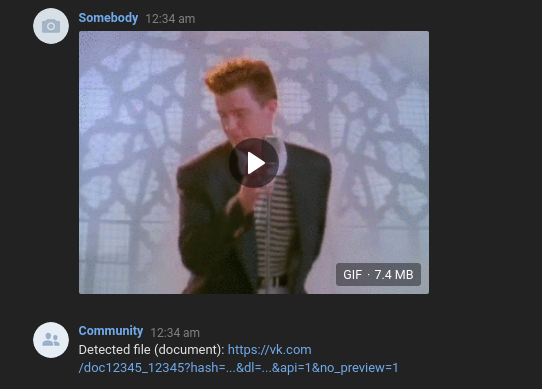

### Listening for location

Native way for receiving location.

**Note**: no message text will be provided via `receivesLocation()` method.

```php
$botman->receivesLocation(function($bot, $location) {
    $lat = $location->getLatitude();
    $lng = $location->getLongitude();

    $bot->reply("Detected location: $lat $lng");
});
```

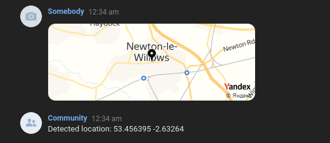

### Receiving messages with mixed attachments

Message with mixed attachments can be asked via `hears()`, `ask()` or `fallback()` method (`IncomingMessage` with message text and attachments with all supported types).

Example with video and image attachments:

```php
$botman->hears('I have both image and video for you.', function ($bot) {
    $bot->reply("Cool!");

    // Scanning for images
    $images = $bot->getMessage()->getImages() ?? [];
    foreach ($images as $image) {

        $url = $image->getUrl();

        $bot->reply("Image found: {$url}");
    }

    // Scanning for videos
    $videos = $bot->getMessage()->getVideos() ?? [];
    foreach ($videos as $video) {
        $payload = $video->getPayload();

        $bot->reply("Video found: {$payload["title"]}");
    }
});
```

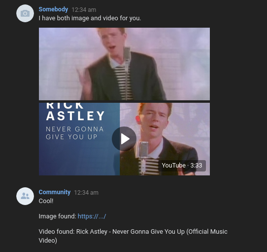

### Retrieving extra user data

Extra user fields should be defined in `.env` file and can be accessed via `getUser()->getInfo()` method.

**⚠ \[Migrating from v.1.5.x and older\]** screen_name is now used by the driver too. Remove `screen_name` value from `user_fields` parameter to prevent sending `screen_name` twice. Use `$bot->getUser()->getUsername()` to get username.

Example contents of `.env`:

```dotenv
# ...
VK_USER_FIELDS="photo_200_orig"
# ...
```

Example route:

```php
$botman->hears('Gimme my photo_200_orig', function ($bot) {
    $bot->reply('Here it is: '.$bot->getUser()->getInfo()["photo_200_orig"]);
});
```


Multiple fields should be comma-separated:

```dotenv
# ...
VK_USER_FIELDS="photo_200_orig, photo_50"
# ...
```

See [User object](https://vk.com/dev/fields) for available fields.


### Retrieving extra client information

Information about supported features of user's VK client can be accessed via `$bot->getMessage()->getExtras("client_info")`:

**Note:** the feature works only with new messages sent (`message_new` event).

```php
$botman->hears('my info', function(BotMan $bot) {
    // Prints raw "client_info" array
    $bot->reply(print_r($bot->getMessage()->getExtras("client_info"), true));
});
```

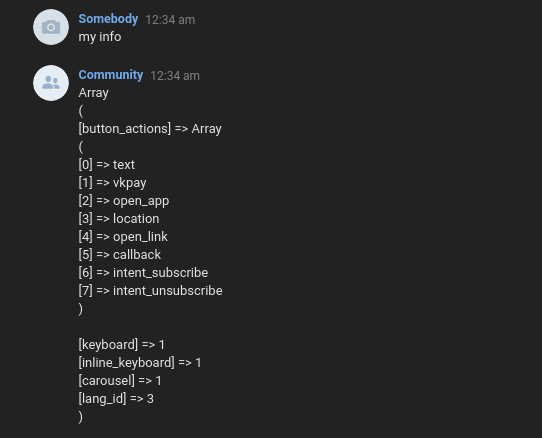


See [Information about features available to the user](https://vk.com/dev/bots_docs?f=2.3.%20Information%20about%20features%20available%20to%20the%20user) for more details.


### Mark seen example

Every message will be marked as seen even if there is no response for it:

```php
$botman->hears("Don\'t answer me", function ($bot) {
    // Do nothing
});
```

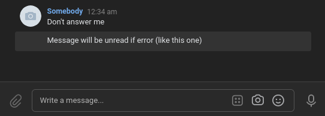

### Listening to events

List of supported events:
- `confirmation`
- `message_allow`
- `message_deny`
- `message_typing_state`        *
- `message_event`               *
- `photo_new`
- `photo_comment_new`
- `photo_comment_edit`
- `photo_comment_restore`
- `photo_comment_delete`
- `audio_new`
- `video_new`
- `video_comment_new`
- `video_comment_edit`
- `video_comment_restore`
- `video_comment_delete`
- `wall_post_new`
- `wall_repost`
- `wall_reply_new`
- `wall_reply_edit`
- `wall_reply_restore`
- `wall_reply_delete`
- `board_post_new`
- `board_post_edit`
- `board_post_restore`
- `board_post_delete`
- `market_comment_new`
- `market_comment_edit`
- `market_comment_restore`
- `market_comment_delete`
- `market_order_new`            *
- `market_order_edit`           *
- `group_leave`
- `group_join`
- `user_block`
- `user_unblock`
- `poll_vote_new`
- `group_officers_edit`
- `group_change_settings`
- `group_change_photo`
- `vkpay_transaction`           *
- `app_payload`                 *
- `like_add`                    *
- `like_remove`                 *

\* - missing english version in VK docs, but feature exists (as for 14.08.2020)

\*\* - missing in VK docs, but feature exists (as for 14.08.2020)

**Note:** events of `message_new`, `message_reply`, `message_edit` are assessable via Hearing Messages functions (e.g. `$botman->hear()`).

[Full list of events (VK docs)](https://vk.com/dev/groups_events)

Example of sending message when the typing state changed:

```php
$botman->on("message_typing_state", function($payload, $bot){
    // $payload is an array of the event object ("Object field format"),
    // excepting Confirmation event, where $payload contains full root JSON schema.
    // See https://vk.com/dev/groups_events for more info
    $bot->say("Hey! You're typing something!", $payload["from_id"]);
});
```

**Note:** `$bot->reply()` is not supported here, use `$bot->say("...", $peer_id_from_data)` instead.

The result:

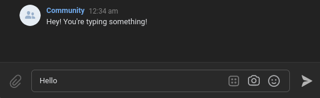

ℹ️ Don't forget to enable a `Typing status` event in `Callback API -> Event types` tab. 

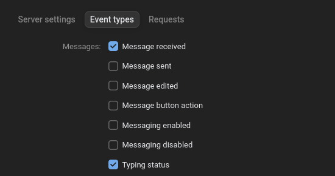

### Sending low-level API requests

Example of sending a sticker via `$bot->sendRequest()`:

**Note:** it is also possible to send stickers via additional parameters.

```php
$botman->hears('sticker', function($bot) {
    // API method
    $endpoint = "messages.send";
    
    // Arguments ("v" and "access_token" are set by driver, no need to define)
    $arguments = [
         "peer_id" => $bot->getUser()->getId(), // User ID
         "sticker_id" => 12, // Sticker ID
         "random_id" => 0 // required by VK API
    ];

    $test = $bot->sendRequest($endpoint, $arguments);
    // $test now equals to ["response" => 1234];
});
```

The result:


## See also
- [VK documentation for developers](https://vk.com/dev/callback_api)
- [New VK documentation for developers](https://dev.vk.com/)
- [BotMan documentation](https://botman.io/2.0/welcome)

## License
VK Community Callback driver is made under the terms of MIT license. BotMan is free software distributed under the terms of the MIT license.